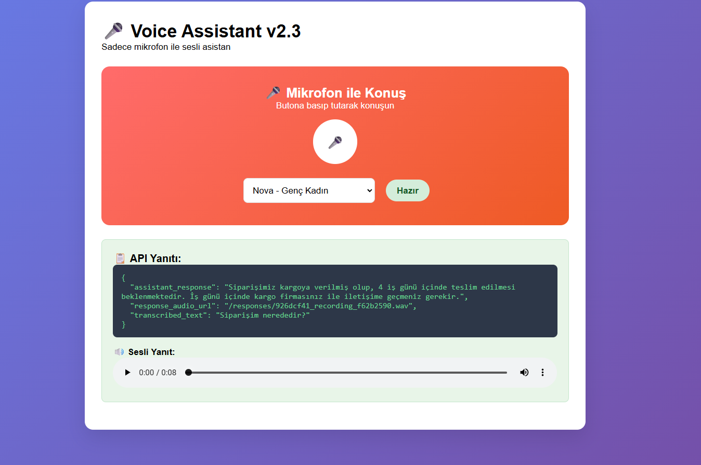

# VoiceAsistant


````markdown
# 🎤 Voice Assistant - E-Ticaret Ses Asistanı

Kullanıcıların ses ile soru sormasını ve AI’dan sesli yanıt almasını sağlayan modern bir sesli asistan uygulaması.  
E-ticaret odaklıdır ve sipariş takibi, kargo durumu, iade süreçleri gibi müşteri hizmetleri sorularına yanıt verir.

---

## 🌟 Özellikler

* 🎤 **Ses Tanıma (STT)** → OpenAI Whisper ile Türkçe ses tanıma  
* 🤖 **AI Yanıtları** → Together AI (Mistral 7B) ile akıllı yanıtlar  
* 🔊 **Ses Üretimi (TTS)** → OpenAI TTS ile doğal ses sentezi  
* 🌐 **Web Arayüzü** → Flask tabanlı, kullanıcı dostu ve hızlı  
* 🛡️ **Güvenlik** → Dosya validasyonu, hata yönetimi ve güvenli API kullanımı  

---

## ⚠️ Önemli Notlar - Few-shot Örneği

Elimde RAG veya fine-tuning için kullanılacak hazır bir veri olmadığından, modelin yanıtlarını yönlendirmek için **Few-shot** kullandım.  
Bu kısmı kaldırıpda deneyebilirsiniz.

```json
[
    {"role": "user", "content": "Siparişim nerede?"},
    {"role": "assistant", "content": "Siparişiniz kargoya verilmiş olup, 4 iş günü içinde teslim edilmesi beklenmektedir."},
    {"role": "user", "content": "Kargom ne zaman gelir?"},
    {"role": "assistant", "content": "Kargonuz yola çıkmıştır, 2-3 iş günü içinde adresinize teslim edilmesi beklenmektedir."},
    {"role": "user", "content": "İade nasıl yapabilirim?"},
    {"role": "assistant", "content": "Ürün iadesi için hesabınıza giriş yapıp, 'Siparişlerim' bölümünden iade talebi oluşturabilirsiniz. Kargo görevlisi ürünü adresinizden alacaktır."},
    {"role": "user", "content": "Teslimat adresimi değiştirebilir miyim?"},
    {"role": "assistant", "content": "Siparişiniz henüz kargoya verilmediyse, adres değişikliğini müşteri panelinizden yapabilirsiniz. Eğer kargoya verildiyse kargo firması ile iletişime geçmeniz gerekir."}
]
````

---

## 🖥️ Model Çalışır Hali

Aşağıda Voice Assistant modelinin çalışır haldeki ekran görüntüsü gösterilmektedir:



---


##  Kurulum (Docker ile)

1. Repo’yu klonlayın ve klasöre girin:

```bash
git clone https://github.com/hakanalphan/VoiceAsistantdocker.git
cd VoiceAsistantdocker
```

2. `.env` dosyasına API key’leri ekleyin:

```
OPENAI_API_KEY=sk-your-openai-api-key
TOGETHER_API_KEY=your-together-api-key
```

3. Docker imajını build edin:

```bash
docker build -t voiceassistant2 .
```

4. Container’ı çalıştırın:

```bash
docker run -it -p 5000:5000 --env-file .env voiceassistant2
```

5. Tarayıcıdan açın:
   👉 [http://127.0.0.1:5000](http://127.0.0.1:5000)

---

⚡ Artık mikrofonunuzla soru sorabilir ve AI’dan anında sesli yanıt alabilirsiniz!

```


